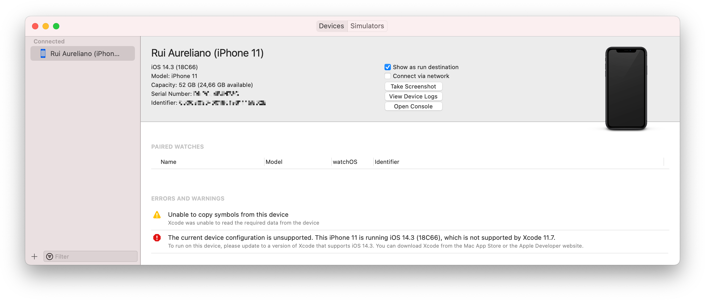
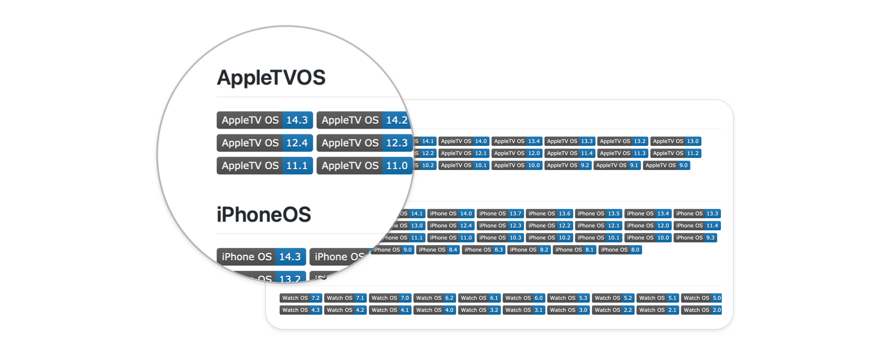
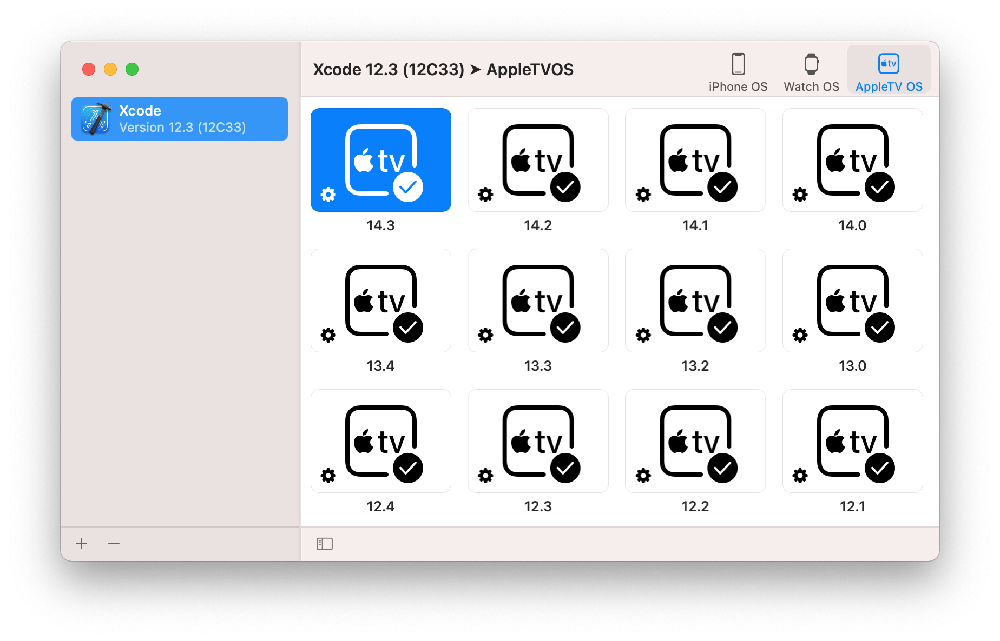
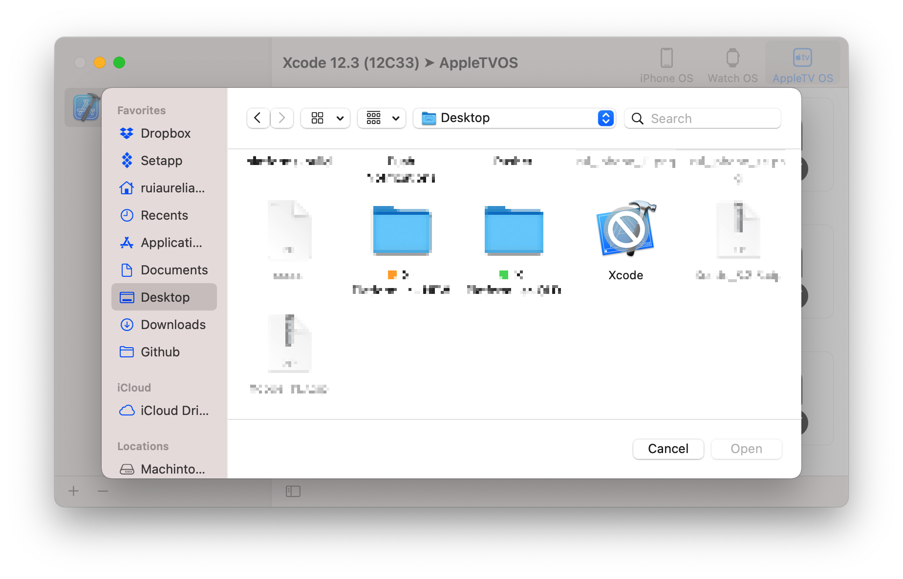
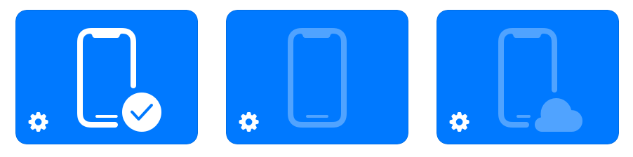
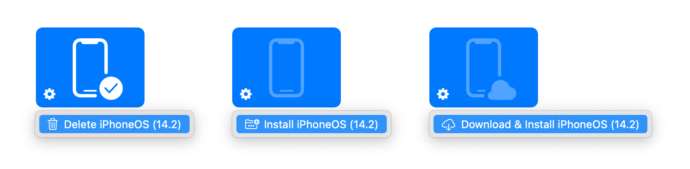

# ⚒️ X-PlatformManager

[](./LICENSE.md) [](https://swift.org/blog/swift-5-6-released/) [](./DOCS.md)


**X-PlatformManager** is a macOS app for managing Xcode platforms (**iOS**, **TVOS** ,and **WatchOS**), why we need this?, everytime we upgrade our device OS, Xcode stops to recognize when you connect the device 🤯.



```
🛑 The current device configuration is unsupported. This iPhone 11 is 
   running iOS 14.3 (18C66), which is not supported by Xcode 11.7.

   To run on this device, please update to a version of Xcode that supports iOS 14.3.
   You can download Xcode from the Mac App Store or the Apple Developer website 
```

There's an updated list (*December 23, 2020*) of **iOS**, **TVOS**, and **WatchOS** platforms 💪

[](./PLATFORMS.md)

This happens because Xcode doesn't have the latest platform images, as suggested you can upgrade Xcode, but if for some reason you want (or need) to keep the current version, there's a workaround. You can do this manually, [**check how to**](./DOCS.md) or use this cool app 🥸

## Installation

### Using Github

[](https://github.com/ruiaureliano/X-PlatformManager/releases/download/1.0/x-platformmanager_1.0.zip)

## Usage

Once downloaded, when you first run the app, it will look for instances of Xcode installed in `/Applications` folder. You can select the platform device **iOS**, **TVOS**, and **WatchOS** and you will get a list of versions installed 🚀



You can add other Xcode instances using the **`+`** button (logically the **`-`** will delete a xcode instance) 🤘



For each item, there are three possible states



+ **`Installed`** - It's installed  for the selected Xcode instance 
+ **`Downloaded`** - It's located in other Xcode instance, but not installed for the selected Xcode instance 
+ **`Cloud`** - Its store on the [**cloud**](./PLATFORMS.md) and can be downloaded and installed

Press the ⚙️ to see options available 👈



---

I'm [Rui Aureliano](http://ruiaureliano.com), iOS and macOS Engineer at [Olá Brothers](https://theolabrothers.com). We make [Sip](https://sipapp.io) 🤓

[Linkedin](https://www.linkedin.com/in/ruiaureliano) | [AngelList](https://angel.co/ruiaureliano) | [Twitter](https://twitter.com/ruiaureliano) | [Github](https://github.com/ruiaureliano) | [Medium](https://medium.com/@ruiaureliano) | [Stackoverflow](https://stackoverflow.com/users/881095/ruiaureliano)
